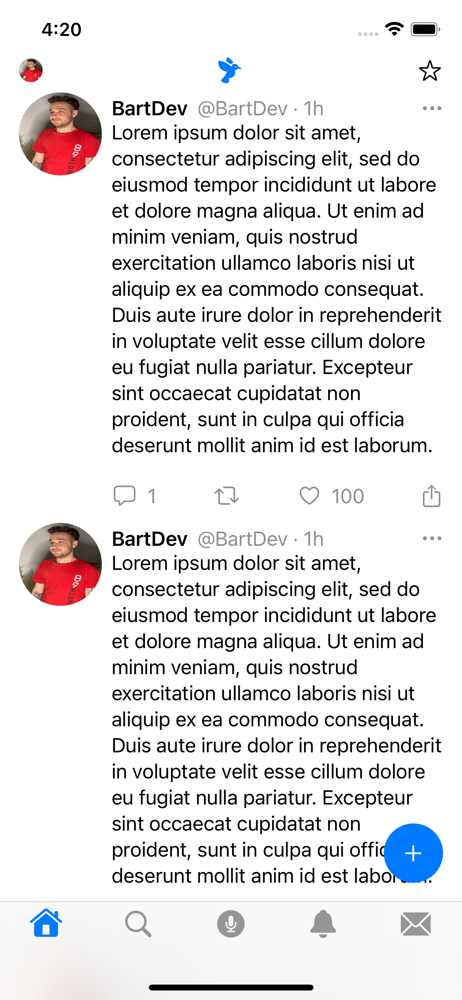
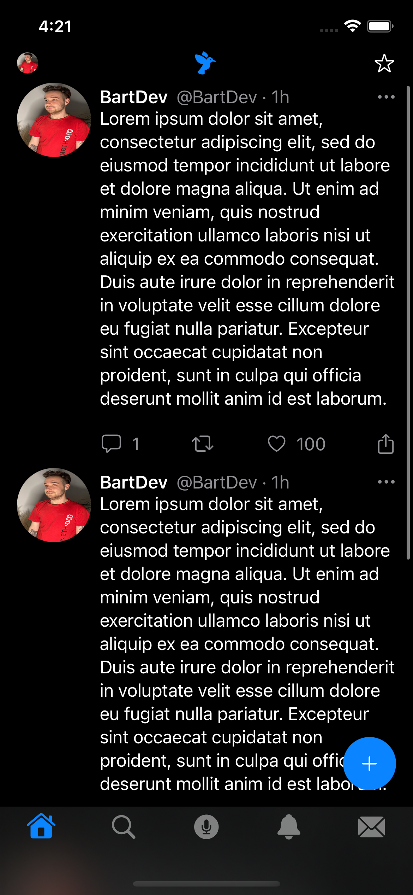
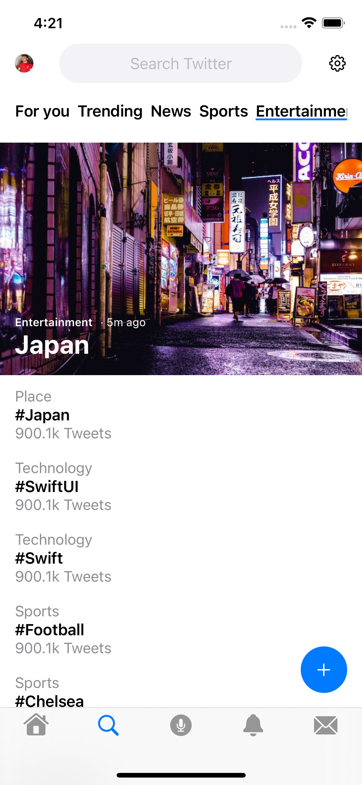
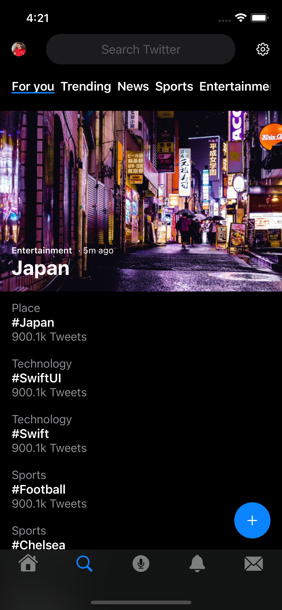
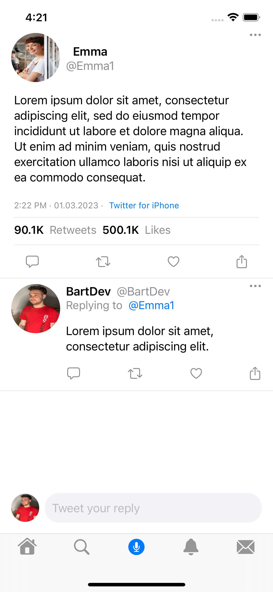
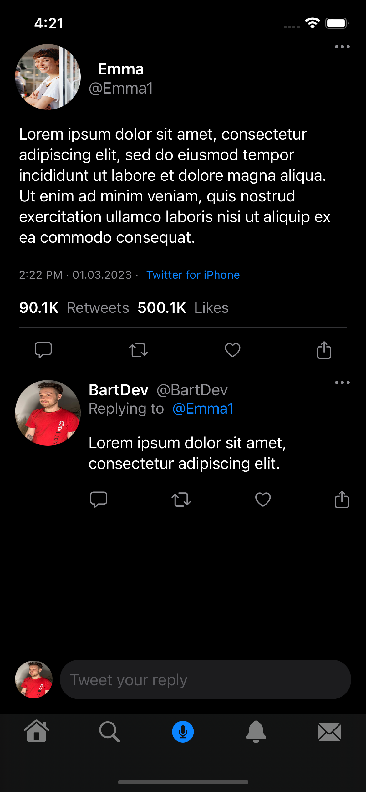
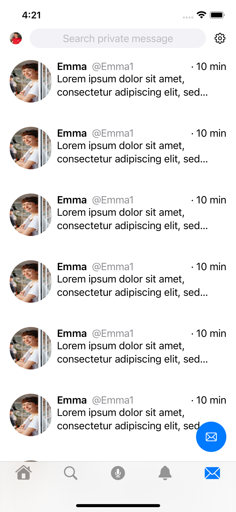
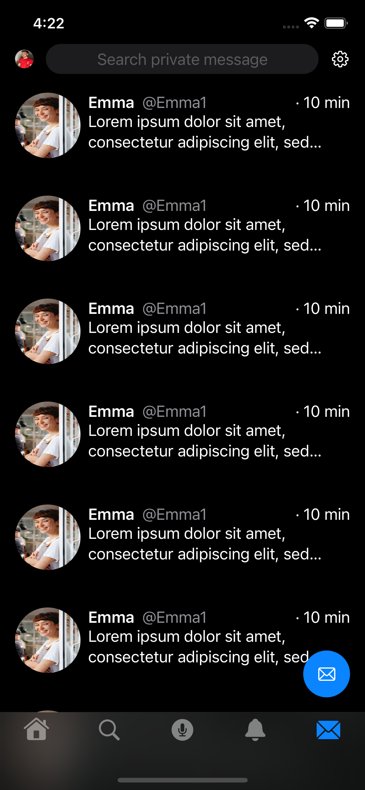

# TwitterUI
I've created this simply project to try recreate Twitter user interface. I have not implemented any functionalities at this point. Project contains only
view files such as components and screens. In the next sections I've described used techonologies, borrowed images and provided screens of the application.
 
 
 

### Used Technologies:
1. SwiftUI
2. SFSymbols

### Images
1. Woman photo by Tim Douglas from Pexels - [a link](https://www.pexels.com/pl-pl/zdjecie/restauracja-kobieta-kelner-kawiarnia-6205635/)

### Screenshots
 
Home screen:
 
  
 
Search screen:
 
  
Tweet screen:
 
 
Messages screen:
 
 
 
